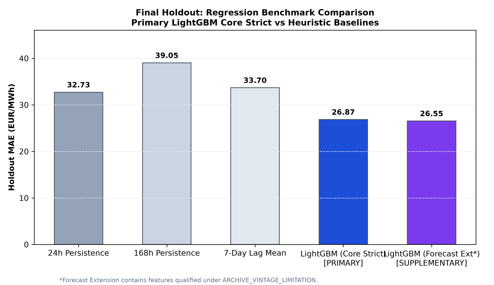
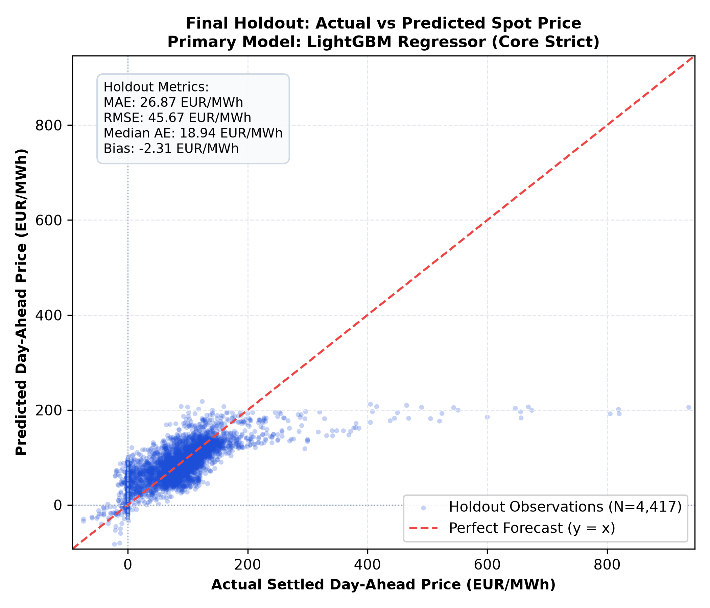
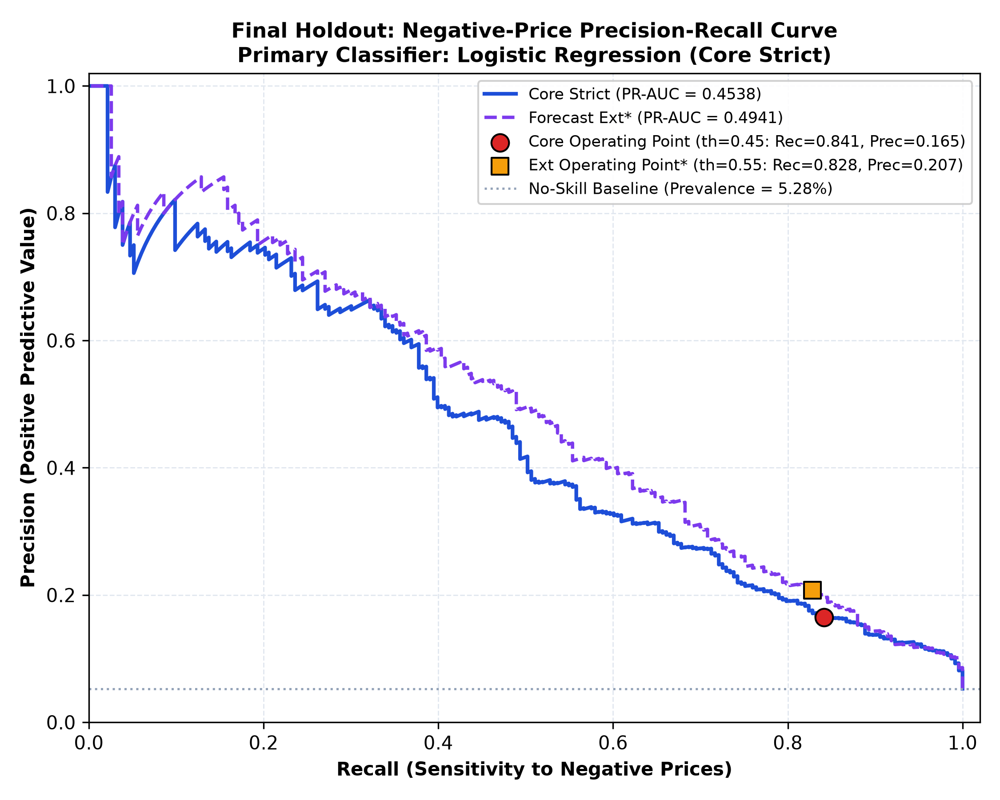
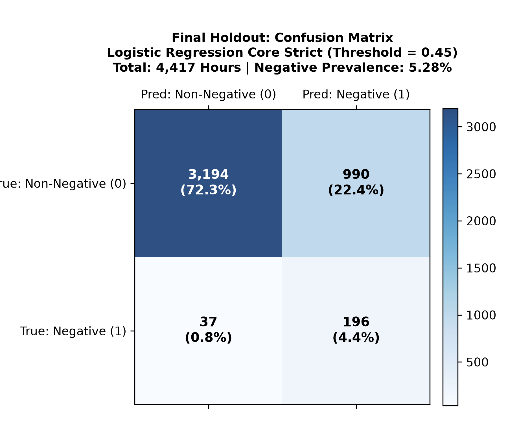

# German Day-Ahead Electricity Price Forecasting

This project builds a leakage-safe, end-to-end machine learning pipeline to forecast hourly wholesale electricity spot prices and detect negative-price risks in the German/Luxembourg (DE-LU) day-ahead market. Operating under realistic pre-auction operational constraints, the system models continuous clearing prices with gradient boosting and flags negative-price hours via classification. All models and decision thresholds were frozen in Git before a single out-of-sample evaluation on an untouched six-month final holdout period.

---

## Key Results

| Metric | Primary Result (Core Strict) | Context / Note |
|---|---|---|
| **Regression MAE** | **26.87 EUR/MWh** | Primary model (LightGBM Candidate D) |
| **Improvement vs 24h Persistence** | **17.91%** | Baseline MAE: 32.73 EUR/MWh |
| **Negative-Price Recall** | **84.12%** | Captured 196 of 233 negative-price hours (threshold 0.45) |
| **Negative-Price PR-AUC** | **0.4538** | Primary classifier (Logistic Regression) |
| **Final Holdout** | **4,417 unseen hourly observations** | H2 2024 (Jul 1 – Dec 31, 2024) |
| **Test Suite** | **62 tests passed** | Complete automated test suite passing (0 failed) |

---

## 1. Project Objective

Day-ahead electricity prices in European wholesale markets (EPEX SPOT) clear daily at 12:00 Europe/Berlin local market time on D-1 (CET/CEST as applicable) for delivery across the 24 hours of the following day ($D$). Two distinct forecasting objectives are addressed:

1. **Regression Objective**: Forecast the continuous hourly settlement price (EUR/MWh) for delivery day $D$, evaluated against standard heuristic persistence benchmarks using Mean Absolute Error (MAE).
2. **Classification Objective**: Provide an early-warning alert for hours where prices clear below zero (EUR/MWh $< 0.00$), evaluated via Precision-Recall AUC (PR-AUC) and operational sensitivity (Recall).

The project emphasizes:
- **Temporal Leakage Prevention**: Features for delivery day $D$ are strictly limited to data published before 12:00 Europe/Berlin local market time on D-1 (CET/CEST as applicable).
- **Chronological Evaluation**: Time-ordered splitting avoids lookahead bias inherent in randomized cross-validation.
- **Reproducibility**: Complete unit and integration test coverage across ingestion, DST transitions, feature engineering, and model scoring.
- **Untouched Holdout Evaluation**: Strict governance separating development (TRAIN + VALIDATION) from an uninspected six-month final holdout (H2 2024).

---

## 2. Data

Data is sourced from the official **SMARD** platform of the German Federal Network Agency (*Bundesnetzagentur*) spanning January 1, 2023 through December 31, 2024 at hourly resolution:

- **Day-Ahead Electricity Price (EUR/MWh)**: Settled hourly spot prices for the Germany-Luxembourg (DE-LU) bidding zone.
- **Actual Electricity Load (MWh)**: Realized grid demand across the German control area.
- **Forecast Electricity Load (MWh)**: Day-ahead grid load projections.

For full data quality checks, timestamp continuity, and DST handling, see the [Data Validation Report](reports/data_validation_report.md).

### Provenance Caveat: `ARCHIVE_VINTAGE_LIMITATION`
SMARD retrospective archives may reflect updated historical vintages rather than strictly preserved point-in-time pre-auction snapshots. To maintain strict leakage integrity, the feature space is partitioned into two distinct families:
- **Core Strict (Primary)**: Uses only settled prices, actual load with realistic reporting lags, deterministic calendar variables, and solar proxies. This is the primary leakage-controlled feature set.
- **Forecast Extension (Supplementary)**: Incorporates archived day-ahead load forecast features. Evaluated strictly as a supplementary sensitivity analysis and not used to claim primary performance.

---

## 3. Dataset Split

The dataset contains 17,376 usable hourly intervals following a 168-hour initial warm-up period for lag generation:

| Split | Period (Local Time `Europe/Berlin`) | Row Count | Negative Hours ($P < 0$) | Prevalence | Purpose |
|---|---|---|---|---|---|
| **TRAIN** | 2023-01-08 00:00 to 2023-12-31 23:00 | 8,592 | 287 | 3.34% | Model fitting & scaling parameter estimation |
| **VALIDATION** | 2024-01-01 00:00 to 2024-06-30 23:00 | 4,367 | 224 | 5.13% | Model selection & threshold optimization |
| **FINAL HOLDOUT** | 2024-07-01 00:00 to 2024-12-31 23:00 | 4,417 | 233 | 5.28% | One-time out-of-sample final evaluation |

### Model Freeze Governance
- Model architectures, hyperparameters, and decision thresholds were selected exclusively on VALIDATION data.
- The complete modeling configuration was permanently frozen in Git at commit `23a34db` (see [Final Model Freeze Report](reports/final_model_freeze.md)).
- The final holdout split was evaluated once without any subsequent tuning (`post_holdout_tuning_performed: false`) at commit `c29d190` (see [Final Holdout Report](reports/final_holdout_report.md)).

---

## 4. Feature Engineering

Features are constructed with explicit attention to operational availability prior to 12:00 Europe/Berlin local market time on D-1 (CET/CEST as applicable):

### Core Strict (23 Predictors — Primary Pipeline)
- **Price Lags**: `price_lag_24h`, `price_lag_48h`, `price_lag_72h`, `price_lag_168h` (7-day weekly lag).
- **Rolling Lag Statistics**: `price_daily_lag_mean_7d`, `price_daily_lag_std_7d`, `price_lag_diff_24h`, `price_lag_diff_168h`, `price_daily_lag_max_7d`, `price_daily_lag_min_7d`.
- **Actual Load Lags**: `load_actual_lag_24h`, `load_actual_lag_168h`, `load_actual_daily_lag_mean_7d`, `load_actual_diff_24h`.
- **Calendar & Clock Features**: `hour_of_day`, `day_of_week`, `month`, `is_weekend`, `hour_sin`, `hour_cos`.
- **Holiday & Grid Regimes**: German nationwide public holidays (`is_public_holiday`), bridge days (`is_bridge_day`), and Daylight Saving Time indicator (`is_dst`).
- **Solar Proxy**: Deterministic solar elevation angle proxy (`solar_elevation_proxy`) computed from solar geometry coordinates.

### Forecast Extension (26 Predictors — Supplementary Sensitivity)
- Includes all 23 Core Strict features plus 3 archived forecast features: `load_forecast_mw`, `load_forecast_diff_24h`, and `load_forecast_daily_peak_ratio`.

---

## 5. Model Development

Model exploration followed a structured progression from zero-parameter baselines to nonlinear gradient boosting:

### Regression Pipeline
1. **Heuristic Baselines**: 24h Persistence, 168h Weekly Persistence, and Historical 7-Day Lag Mean.
2. **Linear Benchmark**: Ridge Regression with L2 regularization and `StandardScaler`.
3. **Nonlinear Gradient Boosting**: LightGBM Regressor with early-stopping and conservative tree depth.
4. **Controlled Hyperparameter Refinement**: Evaluated 6 predefined candidate configurations (A–F) on validation data only. Candidate D (constrained depth `max_depth=5`, `num_leaves=15`, `learning_rate=0.03`, `min_child_samples=50`) achieved the lowest validation MAE (18.97 EUR/MWh) and was selected for final freeze.

### Classification Pipeline (Negative-Price Detection)
1. **Baselines**: Majority class dummy and empirical prior dummy classifiers.
2. **Classifiers**: Logistic Regression (with balanced class weighting) vs. LightGBM Classifier.
3. **Model Selection**: Logistic Regression achieved superior validation PR-AUC (0.5914 vs. 0.5471 for LightGBM) across both feature families.
4. **Validation Threshold Optimization**: Evaluated a 17-point grid (0.10 to 0.90) on validation data under an operational constraint requiring Recall $\ge 0.75$ (to function as an early warning alert). Threshold **0.45** was selected and frozen for Core Strict.

---

## 6. Final Regression Results

The frozen primary model (**LightGBM Regressor — Core Strict, Candidate D**) was fitted on combined development data (TRAIN + VALIDATION, 12,959 rows) and scored once on the final holdout (H2 2024, 4,417 rows).

### Frozen Hyperparameters
```python
{
    "objective": "regression",
    "n_estimators": 400,
    "learning_rate": 0.03,
    "num_leaves": 15,
    "max_depth": 5,
    "min_child_samples": 50,
    "subsample": 0.80,
    "subsample_freq": 1,
    "colsample_bytree": 0.80,
    "reg_lambda": 0.0,
    "random_state": 42
}
```

### Final Holdout Performance vs. Benchmarks

| Model / Benchmark | Feature Set | Holdout MAE (EUR/MWh) | Holdout RMSE (EUR/MWh) | Holdout Median AE (EUR/MWh) | Holdout Bias (EUR/MWh) | Improvement vs. Benchmark |
|---|---|---|---|---|---|---|
| **24h Persistence** | Heuristic | 32.73 | 55.45 | 20.91 | -0.19 | Baseline |
| **168h Persistence** | Heuristic | 39.05 | 60.18 | 26.06 | -0.06 | Baseline |
| **7-Day Lag Mean** | Heuristic | 33.70 | 48.74 | 24.32 | -0.22 | Baseline |
| **LightGBM Core Strict (Primary)** | 23 Core Predictors | **26.87** | **45.67** | **18.94** | **-2.31** | **+17.91% vs. 24h**<br>**+31.18% vs. 168h**<br>**+20.27% vs. 7d Mean** |
| *LightGBM Forecast Ext (Supplementary)* | 26 Predictors* | *26.55* | *45.27* | *18.51* | *-1.70* | *+18.89% vs. 24h* |

*\*Qualified under `ARCHIVE_VINTAGE_LIMITATION`.*





---

## 7. Negative-Price Classification

The frozen primary classifier (**Logistic Regression — Core Strict**) with `StandardScaler` and balanced class weighting was scored on the final holdout at the permanently frozen operating threshold of **0.45**.

### Final Holdout Classification Performance

| Metric | Validation (Frozen) | Holdout (Measured) | Change |
|---|---|---|---|
| **PR-AUC** | 0.5914 | **0.4538** | -0.1376 (-23.27%) |
| **ROC-AUC** | 0.9360 | **0.9019** | -0.0341 (-3.64%) |
| **Balanced Accuracy** | 0.8505 | **0.8023** | -0.0482 (-5.67%) |
| **Recall** | 0.7857 | **0.8412** | +0.0555 (+7.06%) |
| **Precision** | 0.3340 | **0.1653** | -0.1687 (-50.51%) |
| **F1 Score** | 0.4687 | **0.2763** | -0.1924 (-41.05%) |

### Holdout Confusion Matrix (Threshold = 0.45)
Across the 4,417 holdout hours (233 negative hours, 5.28% prevalence):
- **True Negatives (TN)**: 3,194
- **False Positives (FP)**: 990
- **False Negatives (FN)**: 37
- **True Positives (TP)**: 196

### Operational Trade-Off
The operating threshold (0.45) successfully prioritized event detection, capturing **196 of 233 negative-price hours (84.12% Recall)**. However, the trade-off is a high false-alarm rate (990 false positives), yielding a Precision of 16.53%. This demonstrates the classic trade-off in extreme-event early warning systems and indicates that while useful as an operational screen, the model is not an autonomous trading trigger.





---

## 8. Generalization Analysis

Reporting performance across splits demonstrates the reality of chronological out-of-sample evaluation:

- **Regression**: MAE increased from **18.97 EUR/MWh** on validation (H1 2024) to **26.87 EUR/MWh** on the final holdout (H2 2024), an increase in absolute error of +41.65%. Despite this degradation, the model outperformed the 24h persistence baseline by **+17.91%** and the 168h persistence baseline by **+31.18%**.
- **Classification**: PR-AUC decreased from **0.5914** on validation to **0.4538** on holdout, while ROC-AUC showed modest change (0.9360 to 0.9019). Event recall improved from 78.57% to 84.12%, but precision fell from 33.40% to 16.53%.

This degradation illustrates why strict chronological holdout evaluation is necessary in power markets: chronological out-of-sample evaluation captures real-world performance shifts that randomized cross-validation obscures.

---

## 9. Project Governance & Leakage Control

This repository implements strict methodological safeguards and data science governance:

- **Strict Temporal Order**: All splits follow strict chronological order; random shuffling and lookahead k-fold cross-validation are prohibited.
- **Pre-Auction Gate Discipline**: All feature transformations rely strictly on data available prior to the Day-Ahead auction cutoff at 12:00 Europe/Berlin local market time on D-1 (CET/CEST as applicable).
- **Two-Tier Feature Hierarchy**: Core Strict features form the primary basis for all conclusions; retrospective forecast features are segregated under `ARCHIVE_VINTAGE_LIMITATION`.
- **Pre-Holdout Git Freeze**: Model selection, candidate hyperparameter tuning, and threshold selection were completed and committed to Git (`23a34db`) prior to opening the holdout.
- **No Post-Holdout Tuning**: Zero hyperparameters, feature definitions, or decision thresholds were modified after scoring the holdout (`post_holdout_tuning_performed: false`).
- **Data Isolation in Fitting**: Preprocessing transformers (`StandardScaler`, class weighting) were fitted strictly on development data (`TRAIN + VALIDATION`) and applied out-of-sample to holdout.

### Audit Trail
- **Data Validation**: [reports/data_validation_report.md](reports/data_validation_report.md)
- **Model Freeze (Commit `23a34db`)**: [reports/final_model_freeze.md](reports/final_model_freeze.md)
- **Final Holdout Evaluation (Commit `c29d190`)**: [reports/final_holdout_report.md](reports/final_holdout_report.md)

---

## 10. Project Structure

```text
├── data/
│   ├── raw/                 # Downloaded SMARD CSV files (git-ignored)
│   └── processed/           # Processed parquet tables & feature matrices
├── reports/
│   ├── figures/             # Diagnostic plots and holdout evaluation figures
│   ├── data_validation_report.md
│   ├── feature_manifest.json
│   ├── final_model_freeze.json
│   ├── final_model_freeze.md
│   ├── final_holdout_metrics.json
│   └── final_holdout_report.md
├── src/
│   ├── __init__.py
│   ├── ingestion.py         # SMARD API data retrieval and schema normalization
│   ├── validation.py        # Data quality, timestamp continuity, and DST verification
│   ├── features.py          # Leakage-safe feature engineering & temporal splitting
│   ├── run_ingestion.py     # Pipeline runner for data ingestion
│   ├── run_validation.py    # Pipeline runner for data validation
│   ├── run_features.py      # Pipeline runner for feature engineering
│   ├── run_baselines.py     # Evaluation runner for baseline models
│   ├── run_ml_models.py     # Evaluation runner for initial LightGBM models
│   ├── run_regression_tuning.py        # Controlled LightGBM regression tuning
│   ├── run_classification_refinement.py # Threshold grid & classifier refinement
│   ├── run_final_holdout.py            # Final holdout scoring and report generation
│   └── models/
│       ├── __init__.py
│       ├── baselines.py     # Heuristic baselines, Ridge, and Logistic pipelines
│       └── ml_models.py     # LightGBM architectures & feature importance utilities
├── tests/
│   ├── test_ingestion_sample.py
│   ├── test_dst_boundaries.py
│   ├── test_validation.py
│   ├── test_features.py
│   ├── test_baselines.py
│   ├── test_ml_models.py
│   ├── test_regression_tuning.py
│   ├── test_classification_refinement.py
│   └── test_final_holdout.py
├── requirements.txt
└── README.md
```

---

## 11. Reproducibility

### Setup Environment
```powershell
# Create and activate virtual environment (Windows PowerShell)
python -m venv .venv
.venv\Scripts\Activate.ps1

# Install pinned dependencies
pip install -r requirements.txt
```

### Run Test Suite
```powershell
# Execute complete automated test suite (62 tests)
python -m pytest
```

### Execute Pipeline
```powershell
# 1. Ingestion and data validation
python src/run_ingestion.py
python src/run_validation.py

# 2. Feature engineering & temporal split
python src/run_features.py

# 3. Model milestones (TRAIN and VALIDATION only)
python src/run_baselines.py
python src/run_ml_models.py
python src/run_regression_tuning.py
python src/run_classification_refinement.py

# 4. Final Holdout Evaluation (Scoring frozen models on H2 2024)
python src/run_final_holdout.py
```

---

## 12. Limitations

- **Dataset Scope**: The dataset covers calendar years 2023–2024 only; longer-term multi-year structural regime shifts are not modeled.
- **Out-of-Sample Degradation**: Final holdout performance was weaker than validation performance (regression MAE increased from 18.97 to 26.87 EUR/MWh). The project does not attribute this degradation to a specific cause.
- **False-Positive Trade-Off**: The negative-price classifier prioritizes operational event recall (84.12%) and consequently produces a substantial number of false positives (16.53% precision).
- **Strict Boundary Exclusion**: Core Strict intentionally excludes features whose publication timing could violate the pre-auction information boundary.
- **Retrospective Forecast Data**: The Forecast Extension uses retrospective forecast data and is treated strictly as supplementary sensitivity analysis because immutable historical point-in-time publication vintage is not guaranteed.
- **Non-Production Scope**: No claim of production readiness or live trading profitability is made; the pipeline is designed for methodological benchmarking and research evaluation.

---

## 13. Tech Stack

- **Language & Runtime**: Python 3.11
- **Data Manipulation**: pandas, NumPy, PyArrow
- **Machine Learning**: scikit-learn, LightGBM
- **Visualization**: Matplotlib
- **Testing & QA**: pytest
- **Version Control**: Git

---

## 14. Key Takeaways

1. **Strict Temporal Integrity**: Energy market forecasting requires chronological splitting and realistic pre-auction cutoff discipline; standard random cross-validation introduces severe lookahead bias.
2. **Nonlinear Gains Over Persistence**: LightGBM achieved a **17.91% MAE improvement** over 24h persistence and **31.18%** over 168h weekly persistence on unseen holdout data.
3. **Negative-Price Early Warning**: Setting an operational threshold (0.45) enabled capturing **84.12% of negative-price events**, providing actionable early warning at the expense of a higher false-alarm rate.
4. **Honest Out-of-Sample Evaluation**: Transparently reporting holdout degradation (MAE increasing from 18.97 to 26.87 EUR/MWh) underscores the importance of untouched holdouts over synthetic validation scores.
5. **Auditable Governance**: Pre-holdout model freezes, separate supplementary feature tracks, and full test automation ensure every metric is reproducible and untainted by post-hoc optimization.
